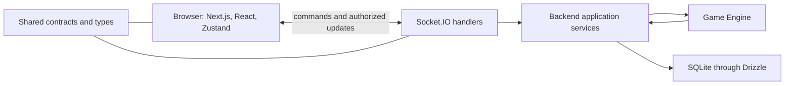

# Project Architecture and Structure

## What This Document Describes

This guide explains the intended V0 architecture described in `specs/`. The current checkout contains the project specifications and workflow documents, but no `web-game/`, `backend/`, or application package manifest yet. The technologies and directories below describe the planned application; they are not a claim that the game runtime is already implemented here.

## The System at a Glance

Noname V0 is a local multiplayer game. One Host machine runs the web application, game server, Game Engine, and local database. Every player, including the Host, uses a browser connected to that machine over the same LAN or Wi-Fi network.

The server is authoritative: a browser asks to do something, such as select or reveal a card, and the server decides whether that action is valid. The server then updates the game and sends each browser the information that player is allowed to see.

The Game Engine returns validated state transitions to backend services. Services apply the successful transition before the Socket.IO layer broadcasts updates. The diagram shows responsibilities, not a required process or deployment split.

## Technology Stack

| Area | Technology | Why it is used |
| --- | --- | --- |
| Web application | Next.js, React, TypeScript | Build browser screens and organize routes, layouts, and page composition. |
| Interface styling | Tailwind CSS, shadcn/ui | Style the interface and reuse UI building blocks. |
| Browser state | Zustand | Keep a convenient client-side view of server updates; it is not the source of game truth. |
| Server runtime | Node.js, TypeScript | Run the Host-side application services and game server. |
| Realtime communication | Socket.IO | Carry player commands to the Host and game updates back to browsers. |
| Game rules | Custom TypeScript Game Engine | Validate commands and compute authoritative gameplay transitions. |
| Local persistence | SQLite, Drizzle ORM | Store data that must survive a Host restart, such as static game content. |
| Verification | Vitest, Playwright | Test game rules and backend behavior, then exercise complete browser flows. |

The stack is intentionally local and small. V0 does not require a cloud service, public matchmaking, or multiple backend servers.

## Project Structure

The intended application directories are grouped by responsibility:

- **`web-game/app/`** — Next.js routes, layouts, and page composition.
- **`web-game/components/`** — reusable React interface components.
- **`web-game/features/`** — feature-specific screens and browser behavior, such as joining a session or selecting a card.
- **`web-game/stores/`** — shared Zustand state and explicit client state actions.
- **`web-game/shared/`** — browser-side types and utilities shared by web-game features.
- **`web-game/game/`** — the custom Game Engine, domain types, game rules, and state transitions. Backend services execute this code on the Host; it must not be bundled into the browser or depend on React, Next.js, Socket.IO, or database code.
- **`backend/`** — Host-side application services, Socket.IO setup, and event handlers.
- **`backend/db/`** — Drizzle schema, database access, and SQLite migrations.
- **Root `shared/`** — contracts and types used by both the browser application and backend.
- **`tests/`** — shared test setup and end-to-end coverage. Focused tests may also live near the code they cover.

This separation helps each area change for its own reasons. For example, a page can be redesigned without changing scoring rules, and storage details can change without putting database calls into the Game Engine.

## What Next.js Does

Next.js provides the web application that players open in their browsers. Its `app/` area organizes routes, layouts, and page composition; React components render those pages and handle local interactions.

Next.js is not the authority for the game. The browser can collect a card choice and send it to the Host, but it cannot decide that a card was valid, change the score, assign teams, or advance the phase by itself. Those decisions belong to server-side application services and the Game Engine.

## The Game Engine

The custom Game Engine is the rulebook turned into state transitions. It receives the current authoritative game state and a requested action, checks the relevant game rules, and returns either a valid next state or a predictable domain error.

It owns team assignment, card selection, phase and round changes, attacks and defenses, card-use tracking, scoring, and the final winner or draw. Random choices are kept controllable so the rules can be tested. The engine does not know about browser components, Socket.IO connections, or SQLite. This makes gameplay rules easier to test and prevents a UI change from creating a second, conflicting version of the rules.

## Backend and Communication

The backend connects the browser transport to application behavior:

1. A browser sends an intent through Socket.IO, using the player's server-issued session identity.
2. A Socket.IO handler checks the message shape, the player's identity and permissions, and whether the action is allowed in the current phase.
3. An application service calls the Game Engine with the validated action and current state.
4. If the engine accepts the action, the service applies its state transition. Invalid actions leave the game unchanged.
5. The server sends updated views to connected browsers. It filters private information for each player; for example, Sheep players do not receive unrevealed Wolf selections.
6. Zustand keeps the browser's displayed state in sync with those server updates. Refreshing the page requests the current view from the still-running Host.

The client sends intentions, not trusted outcomes. It does not submit authoritative scores, teams, card ownership, turn order, or game phase. Socket.IO handlers coordinate and validate requests; they do not contain the core game rules themselves.

## Database and Persistence

SQLite is a local database on the Host machine. The specifications place its schema, access, and migrations in `backend/db/`; Drizzle ORM is the only database access layer. Browsers never connect directly to SQLite.

The database is for information that needs to survive process restarts, especially predefined card categories and challenge content. The active session and live game state stay in server memory for V0. That is why a browser refresh can recover from a running Host, while recovery after the Host process itself restarts is not promised.

The exact SQLite file path and final schema are not specified yet. They will be defined during implementation without moving database responsibilities into the Game Engine or browser.

## A Game from Start to Finish

Players join the Host's lobby with display names. When at least six players are connected, the Host can start. The server assigns everyone, including the Host, to balanced Wolf and Sheep teams.

During card selection, each player manages one personal card slot. The server records submitted choices. The turn phase begins after every player has submitted a complete choice; if the selection timer reaches zero first, selection stays open until all slots are complete.

In each round, only the Wolf player who selected a card can reveal it. A Sheep player with an unused card in the matching category handles the defense and challenge. If several Sheep players qualify, the first valid defense accepted by the server resolves the attack. Participants or the Host determine whether the challenge succeeded, and the Host records the outcome. The Game Engine applies the score and advances the game. At the end, the server sends every player the final scores and winner or draw.

## Why the Architecture Is Designed This Way

- **One authority avoids conflicting games:** The Host decides state changes, so players do not calculate different scores or phases on their own.
- **The Game Engine stays testable:** Pure game rules can be exercised without a browser, network connection, or database.
- **Responsibilities stay separate:** UI, transport, game rules, and persistence can evolve without being tightly coupled.
- **Private information stays on the server:** Each client receives only the game view it is permitted to see.
- **V0 stays practical for local play:** One Host machine and SQLite meet the local-network goal without cloud infrastructure.

## Further Reading

- [Project structure](../../specs/03-technical/project-structure.md)
- [System architecture](../../specs/03-technical/architecture.md)
- [Technology stack](../../specs/03-technical/tech-stack.md)
- [Backend architecture](../../specs/04-backend/architecture.md)
- [Database rules](../../specs/04-backend/database.md)
- [Gameplay business rules](../../specs/01-product/business-rules.md)
